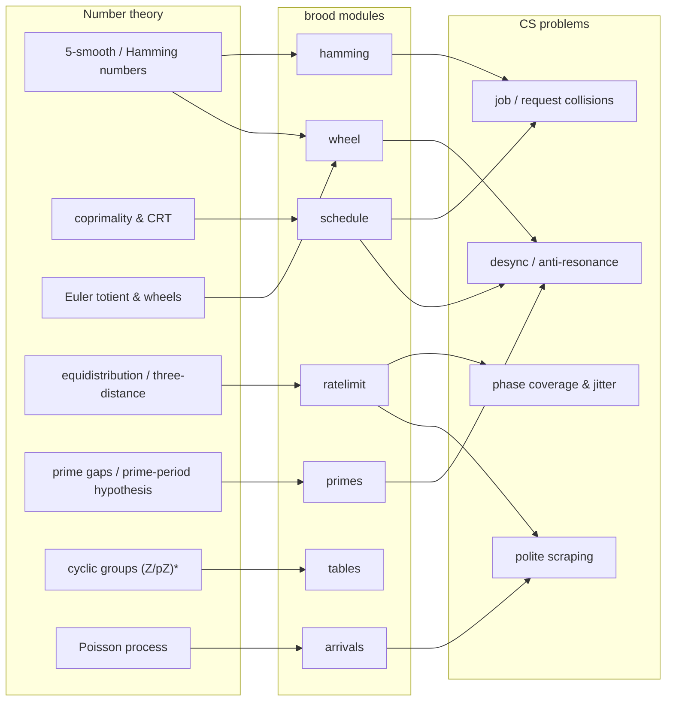

# The mathematics of `brood`

`brood` is one idea wearing several hats: **desynchronization by number
theory.** Periodical cicadas emerge on prime cycles so they rarely share a year
with predators; the same arithmetic — coprimality, the Chinese Remainder
Theorem, smooth numbers, equidistribution — lets you place jobs, requests, and
retries so they rarely share a *tick*. This note is the spine: each piece of
mathematics, the computer-science problem it answers, and the module that
implements it.

## 1. Smooth numbers — the texture of "round" time

A number is **5-smooth** (a *Hamming* or *regular* number) when it factors as
`2^i · 3^j · 5^k`. These are the intervals clocks are built from: `60 = 2²·3·5`,
`3600 = 2⁴·3²·5²`, `86400 = 2⁷·3³·5²` seconds in a day. Because "every N
seconds / minutes / hours" lands on this set, ordinary schedules pile up there.

*The CS move:* to avoid the pile-up, schedule on the **complement** — numbers
with a prime factor greater than 5 ([OEIS A279622](https://oeis.org/A279622)).
A job whose period has a factor outside `{2,3,5}` cannot share that factor with
the round cadences.

> Modules: [`brood.hamming`](../brood/hamming.py) generates the Hamming
> sequence ([OEIS A051037](https://oeis.org/A051037)) via Dijkstra's lazy merge;
> [`brood.wheel`](../brood/wheel.py) enumerates the complement.

## 2. Coprimality and the Chinese Remainder Theorem — when cadences collide

Model a periodic job as a **cadence** `(p, φ)`: it fires at every tick `t` with
`t ≡ φ (mod p)`. Two cadences `(p₁, φ₁)` and `(p₂, φ₂)` meet exactly when the
congruences are simultaneously solvable. By the **Chinese Remainder Theorem**,
with `g = gcd(p₁, p₂)`:

- they **never** coincide if `(φ₁ − φ₂)` is not divisible by `g`;
- otherwise they first coincide at a tick CRT pins down, and then **once every
  `lcm(p₁, p₂)` ticks** thereafter.

Two consequences drive the whole library. First, **phase** is a lever: when
periods share a factor you can often drop a job into the gap and never collide.
Second, **coprime periods** *must* collide, but only once per `p₁·p₂` ticks —
the rarest possible. That is the cicada strategy stated arithmetically: a 13-
and a 17-year brood share a year only every `13·17 = 221`.

> Module: [`brood.schedule`](../brood/schedule.py) — `coincidence(a, b)` returns
> the first meeting and the recurrence (or `None`); `find_slot` searches both
> levers.

## 3. Euler's totient and wheel factorization — counting the safe slots

The residues in `1..C−1` coprime to `C` form the multiplicative group of units
mod `C`; there are `φ(C)` of them (Euler's totient). For a **wheel** with basis
the first few primes, `C = ∏ basis` and the unit residues are the wheel's
*spokes*. Basis `(2,3,5)` gives `C = 30` and `φ(30) = (2−1)(3−1)(5−1) = 8`
spokes `{1,7,11,13,17,19,23,29}` — every prime past 5 is congruent to one.

*The CS reading:* the spokes are exactly the offsets that share no factor with a
2-, 3-, or 5-periodic job, i.e. the slots that never collide with the round
cadences. Rolling the wheel enumerates all such offsets and lets a sieve skip
most composites.

> Module: [`brood.wheel`](../brood/wheel.py) — `wheel(basis)`, `coprimes_up_to`,
> and a clock plot where the primes land on the spokes.

## 4. Equidistribution and the three-distance theorem — spreading evenly

Take a fixed step `g` on a cycle of length `n`. The visited phases
`{0, g, 2g, …} mod n` are the subgroup generated by `gcd(g, n)`, of size
`n / gcd(g, n)`, hit equally often. So **`gcd(g, n) = 1` ⇒ the phases
equidistribute over the whole cycle** (the discrete cousin of Weyl's
equidistribution theorem for `{kα mod 1}`). Relatedly, the **three-distance
(Steinhaus) theorem** says the points `{kα mod 1}` cut the circle into gaps of
at most three distinct lengths — a fixed irrational-ish step spreads about as
evenly as anything can.

*The CS reading:* a request stream whose period is coprime to a rate-limit
window sweeps every phase of that window uniformly. This does **not** lower
burst size (that is set by your rate) but it governs phase coverage — which
matters for sliding-window limiters and for probing. See
[rate-limiting.md](rate-limiting.md) for the simulated, and honestly
qualified, version.

> Module: [`brood.ratelimit`](../brood/ratelimit.py) — `phase_histogram`,
> `phase_uniformity`, and the coprime `safe_gaps`.

## 5. Prime gaps and the prime-period hypothesis — why primes

Coprimality maximises `lcm`, but *which* periods are coprime to the most
neighbours? Primes. A prey species with a prime period `p` is overtaken by a
predator of period `q` only at multiples of `lcm(p, q) = p·q` (for `q < p`),
the largest possible spacing; a composite period shares factors with many
nearby cycles and resonates often. This is the **prime-number hypothesis** for
*Magicicada*'s 13- and 17-year broods, and the reason "pick a prime period" is
folklore for cron jobs. `brood` does not hard-code the advice — in
[`brood.schedule`](../brood/schedule.py) a prime, coprime to the existing load,
simply *scores* best, so the rule falls out of the math.

> Module: [`brood.primes`](../brood/primes.py) — Sieve of Atkin, `is_prime`,
> `factorize`. The biology and the modelling papers are collected in
> [literature.md](literature.md).

## 6. Cyclic groups `(Z/pZ)*` — why a prime modulus behaves

For a prime `p`, the non-zero residues mod `p` form a **cyclic group** under
multiplication: every row of the mod-`p` multiplication table is a permutation
of `1..p−1` (a Latin square), and a generator visits all of them. Reduce by a
composite modulus and the structure breaks (zero divisors appear). It is a
small but useful sanity check that a prime modulus mixes residues cleanly.

> Module: [`brood.tables`](../brood/tables.py) — `multiplication_table(n, mod)`.

## 7. The Poisson process — memoryless arrivals and human delays

Events that arrive **memorylessly** at average rate `λ` have *Exponential*
inter-arrival gaps (mean `1/λ`); their counts in a window are *Poisson*. This is
the canonical model of "random but steady" traffic — and the limit that
full-jitter backoff approximates: jittered retries converge to an approximately
constant call rate (the AWS result, [literature.md](literature.md)). A second
use: human reaction time clusters near `274 ms`, so delays drawn from
`Poisson(274)` look human rather than metronomic — a gentler politeness for a
scraper than uniform jitter.

> Module: [`brood.arrivals`](../brood/arrivals.py) — `poisson_process`,
> `exponential_gaps`, `human_delays`.

## The map, in one table

| Mathematics | Computer-science problem | Module |
| --- | --- | --- |
| 5-smooth (Hamming) numbers & their complement | avoid the "round-interval" pile-up | `hamming`, `wheel` |
| Coprimality & the CRT | when do two cadences collide, and how rarely | `schedule` |
| Euler totient & wheel factorization | enumerate the non-colliding offsets | `wheel` |
| Equidistribution / three-distance | phase coverage, jitter spreading | `ratelimit` |
| Prime gaps & the prime-period hypothesis | maximise time between coincidences | `primes` |
| Cyclic groups `(Z/pZ)*` | clean residue mixing under a prime modulus | `tables` |
| Poisson processes | memoryless / human-like arrival timing | `arrivals` |

For sources and further reading — the cicada biology, coprime real-time
scheduling, equidistribution and low-discrepancy sequences, and the
desynchronization literature — see **[literature.md](literature.md)**.
