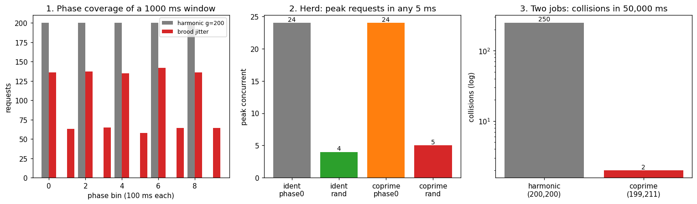

# Pacing against an unknown rate limit

You are calling a service whose rate limit you do not know. You can guess a
few common windows — say **1000 ms, 250 ms, 200 ms** (1, 4, and 5 requests per
second) — and you want to time requests so you never resonate with whichever
one is real. This note formalises the problem, applies `brood`'s number
theory, and then *troubleshoots the result by simulation* — because the desync
trick that works for cron-job collisions does **not** do what you might expect
here, and it is worth being precise about what it does and does not buy.

All numbers and the figure below come from
[`scripts/troubleshoot_ratelimit.py`](../scripts/troubleshoot_ratelimit.py);
re-run it to reproduce them.



## 1. The arithmetic gift

The assumed windows are all 5-smooth (Hamming) numbers:

```
1000 = 2^3 * 5^3      250 = 2 * 5^3      200 = 2^3 * 5^2
```

They share only the primes 2 and 5. So a gap **coprime to all of them** is
simply a gap coprime to 10 — odd and not a multiple of 5. That is exactly the
wheel of `brood.wheel` with basis `(2, 5)`: circumference 10, spokes
`{1, 3, 7, 9}`. `brood.ratelimit.window_basis([1000, 250, 200])` returns
`[2, 5]`, and `safe_gaps(...)` enumerates the coprime delays. Drawing request
gaps from that set is the natural "brood move" — the question is whether it
helps.

## 2. Model

Time is integer milliseconds. A client emits requests at instants
`t_0 < t_1 < ...` with gaps `g_i = t_{i+1} - t_i`. A **fixed-window** limiter
with window `W` and capacity `C` partitions time into buckets
`B_k = [kW, (k+1)W)` and admits the first `C` requests in each bucket,
rejecting the rest; a **sliding-window** limiter instead counts requests in
*any* interval of length `W`. The window `W` and capacity `C` are unknown; we
assume `W` lies in `𝒲 = {1000, 250, 200}`.

Two requests **overlap under `W`** when they share a bucket. The **phase** of a
request under `W` is `t mod W`. A **burst** is a bucket holding many requests;
rejections happen when a burst exceeds `C`.

## 3. Finding 1 — burst size is set by your *rate*, not your arithmetic

For a periodic stream of period `g`, the number of requests in any window of
length `W` is either `⌊W/g⌋` or `⌈W/g⌉` — it depends only on the ratio `W/g`,
**not** on `gcd(g, W)`. Coprime gaps cannot reduce it; a non-dividing period
can even add one. Experiment 1 (one client, ~200 ms mean gap, 200 s horizon):

| strategy          | W    | max / bucket | max / sliding |
| ----------------- | ---- | ------------ | ------------- |
| harmonic `g=200`  | 1000 | 5            | 5             |
| coprime `g=199`   | 1000 | 6            | 6             |
| random [196,204]  | 1000 | 6            | 6             |
| brood jitter      | 1000 | 6            | 6             |
| harmonic `g=200`  | 250  | 2            | 2             |
| coprime `g=199`   | 250  | 2            | 2             |
| harmonic `g=200`  | 200  | 1            | 1             |
| coprime `g=199`   | 200  | 2            | 2             |

The coprime and harmonic streams burst the same amount (the coprime one is, if
anything, marginally worse). **The only lever on burst size is the rate** `1/ḡ`.
If you must stay under `C` requests per `W` and you do not know `W`, pick a mean
gap safely above the tightest assumed `C/W`; the arithmetic of the gaps will not
save you. This is the honest correction to the naive "desync beats the limiter"
intuition.

## 4. Finding 2 — coprime gaps *do* buy phase coverage

Where the arithmetic shows up is *which* phases of a window you visit. The set
`{i·g mod W}` is the cyclic subgroup generated by `gcd(g, W)`, of size
`W / gcd(g, W)`, visited evenly. So:

- `gcd(g, W) = 1` ⇒ requests **equidistribute** over all of `[0, W)`;
- `g | W` ⇒ requests are **phase-locked** to a sparse lattice.

The peak-to-mean ratio of the phase histogram (1.0 = perfectly uniform) makes
this vivid:

| strategy         | phase peak/mean @ W=1000 | @ W=200 |
| ---------------- | ------------------------ | ------- |
| harmonic `g=200` | 2.00                     | 10.00   |
| coprime `g=199`  | 1.00                     | 1.04    |
| brood jitter     | 1.42                     | 2.87    |

`g=200` lands on only 5 of the 1000 ms window's phases and on a *single* phase
of the 200 ms window (peak/mean = 10); `g=199` sweeps both evenly (left panel of
the figure). Phase coverage matters for **sliding-window** limiters (which see
any `W`-interval, so even spreading lowers the worst case) and for **probing** a
limit by sampling all phases.

One caveat the simulation exposes: *jittering within a narrow band around a
window's own size covers that window poorly.* `brood jitter` drew gaps from
[196, 204], all near 200, so its phase drifts slowly and its 200 ms coverage
(2.87) is worse than a clean coprime offset (1.04). If you want phase coverage,
prefer a fixed coprime offset, or jitter over a range wide relative to the
window — not a tight band around it.

## 5. Finding 3 — for a herd, *phase* is the lever, not the period

The classic failure is a **thundering herd**: many clients triggered at the
same instant (an outage ends, a cache expires) all retry on the same schedule.
Experiment 2 (24 clients triggered together, peak requests in any 5 ms):

| strategy                       | peak in any 5 ms |
| ------------------------------ | ---------------- |
| identical period / phase 0     | 24               |
| identical period / phase random| 4                |
| coprime periods / phase 0      | 24               |
| coprime periods / phase random | 5                |

Read the rows by *phase*, not period: every "phase 0" strategy peaks at the
full 24, and every "phase random" strategy collapses to ~4–5 — **regardless of
whether the periods are coprime.** Coprime periods cannot save the shared
trigger instant `t=0`, because every client fires there. What scatters a herd
is a **random phase offset** — exactly the "jitter your backoff" result from
Marc Brooker's AWS work [1][2]. Period coprimality is neither necessary nor
sufficient for this.

## 6. Finding 4 — where period-coprimality genuinely wins

Coprimality's real domain is the one `brood.schedule` already covers: keeping
*long-lived periodic jobs* from re-colliding. Two cadences with periods
`p1, p2` re-meet every `lcm(p1, p2)`. Experiment 3 (two jobs, 50,000 ms):

| periods            | collisions |
| ------------------ | ---------- |
| harmonic (200,200) | 250        |
| coprime (199,211)  | 2          |

Identical periods collide on every firing; coprime periods (lcm = 41 989) meet
only at multiples of their lcm — twice in the window (right panel, log scale).
This is the cicada result, and it is about *re-collision over time*, not about a
single stream versus a single window.

## 7. Finding 5 — low-discrepancy (golden) pacing helps, with room to breathe

Random jitter clumps; a *low-discrepancy* sequence fills an interval more evenly
(the three-distance theorem bounds the golden sequence's gaps to two lengths in
golden ratio). `brood.ratelimit.golden_jitter` walks that sequence through the
safe pool instead of choosing uniformly at random. Experiment 4 (phase peak/mean
at the 200 ms window, lower = flatter):

| gap range        | uniform | golden |
| ---------------- | ------- | ------ |
| wide [200, 240]  | 1.07    | 1.04   |
| narrow @ window  | 2.95    | 9.84   |

The honest reading: with a **wide** band golden is modestly flatter than random,
and being deterministic it never clumps by luck. But it is *not* a free win — in
a **narrow** band whose gaps sit right at the window size, golden's regularity
*resonates* and is far worse than random (9.84 vs 2.95). The dominant lever is
still the **gap range**, as Finding 2 warned; golden just makes a well-ranged
jitter a little better and a badly-ranged one a little worse. Use it with a band
wide relative to the windows you care about — `Pacer(..., low_discrepancy=True)`.

## 8. Recommendation

For the unknown-limit problem, in priority order:

1. **Rate is safety.** Choose a mean gap above the tightest assumed `C/W`.
   Nothing about the gaps' factorisation changes how many land in a bucket.
2. **Jitter the phase.** A random start offset is what prevents herd pile-ups
   when clients are triggered together. Use full jitter [1].
3. **Draw gaps from the coprime-safe set** (`brood.ratelimit.safe_gaps`, i.e.
   the wheel(2, 5) spokes here). This is secondary: it spreads you across every
   candidate window's phases (good for sliding windows and for probing) and
   keeps independent clients' periods non-harmonic so they do not
   re-synchronise. Jitter over a range *wide* relative to the smallest window.
4. **Never share one fixed period across many clients** — they will resonate
   with each other (Finding 3, row 1).

So the brood move — coprime timing — is real but secondary here: it governs
*phase* and *re-collision*, while *rate* and *phase-jitter* govern whether you
trip the limit. `brood.ratelimit` gives you all three output forms (a seedable
jitter stream, a fixed coprime interval, and a precomputed schedule) so you can
combine rate, jitter, and coprime gaps as above.

## 9. Ready-to-use: the `Pacer`

`brood.ratelimit.Pacer` wires the four pieces together so you don't have to
re-derive them at each call site: the **rate** you choose (a gap band, sized
with `conservative_gap`), a phase-jittered **start**, **coprime gaps** between
calls, and **full-jitter exponential backoff** when the server pushes back.

`conservative_gap` encodes the rate lever — the largest assumed window binds,
because you do not know which is real:

```python
>>> from brood.ratelimit import conservative_gap
>>> conservative_gap([1000, 250, 200], capacity=4)   # ~4 requests per window
250
```

The scheduling is pure and seedable, so you can inspect or test it directly.
The first timestamp is jittered into `[0, max window)`; every gap is coprime to
all the windows:

```python
>>> from brood.ratelimit import Pacer
>>> Pacer([1000, 250, 200], 200, 280, seed=11).plan(8)
[463, 736, 1007, 1238, 1467, 1744, 1973, 2190]
```

In a real client, `run` paces each call and retries with backoff-and-jitter on
a rate-limit signal. `sleep` is injectable, so the same object is unit-testable
without real time:

```python
from brood.ratelimit import Pacer, conservative_gap

gap = conservative_gap([1000, 250, 200], capacity=4)        # 250 ms
pacer = Pacer([1000, 250, 200], lo=gap - 30, hi=gap + 30)   # rate band

def fetch():
    resp = http_get(url)
    if resp.status == 429:
        raise RateLimited()
    return resp

# call once per request; it spaces calls and backs off on 429s
result = pacer.run(fetch, rate_limited=lambda e: isinstance(e, RateLimited))
```

This is the honest synthesis in code: rate and phase-jitter do the heavy
lifting, with coprime gaps spreading you across every candidate window.

## References

1. Marc Brooker, *Exponential Backoff And Jitter*, AWS Architecture Blog —
   https://aws.amazon.com/blogs/architecture/exponential-backoff-and-jitter/
2. Marc Brooker, *Jitter: Making Things Better With Randomness* —
   https://brooker.co.za/blog/2015/03/21/backoff.html
3. *Rate Limiting Algorithms: Token Bucket vs Sliding Window vs Fixed Window*,
   Arcjet —
   https://blog.arcjet.com/rate-limiting-algorithms-token-bucket-vs-sliding-window-vs-fixed-window/
4. OEIS A051037, 5-smooth (Hamming) numbers — https://oeis.org/A051037
